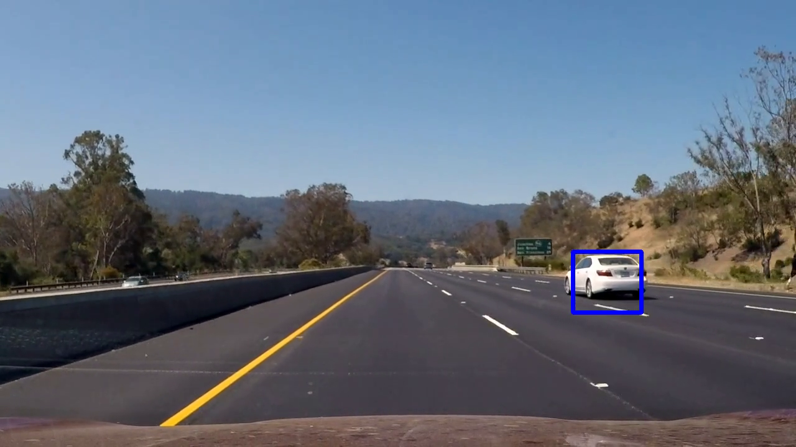
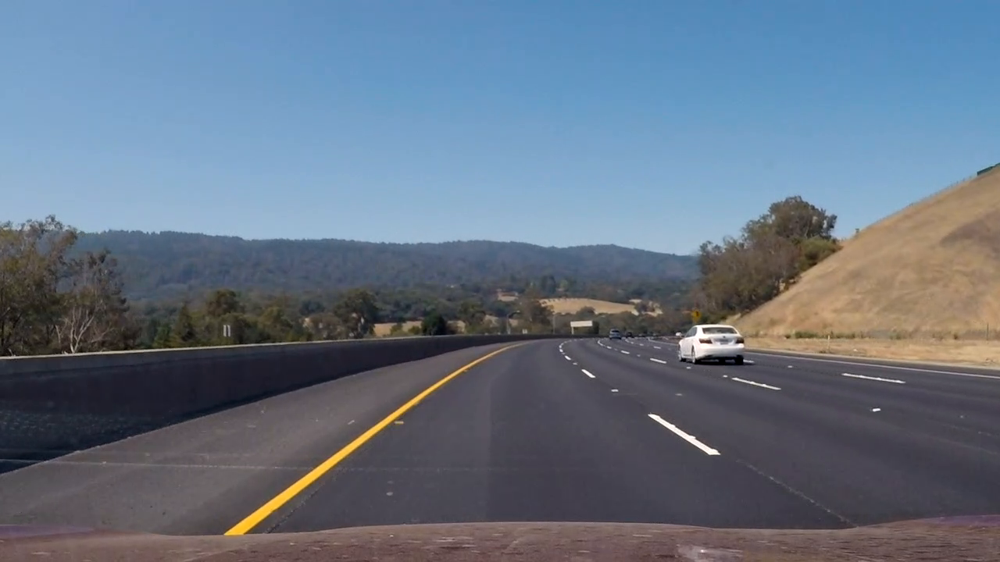
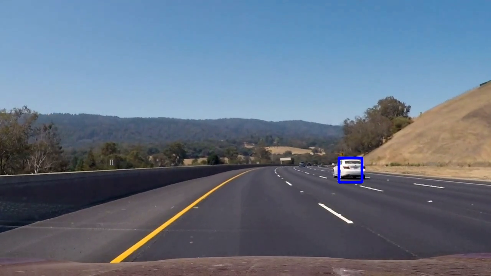
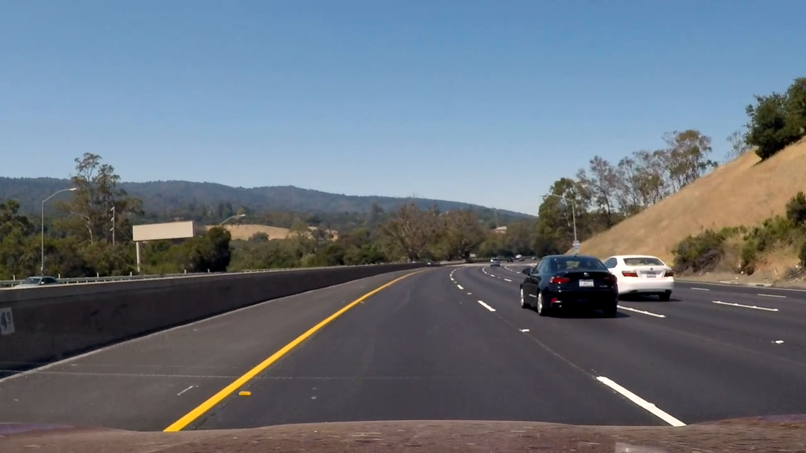
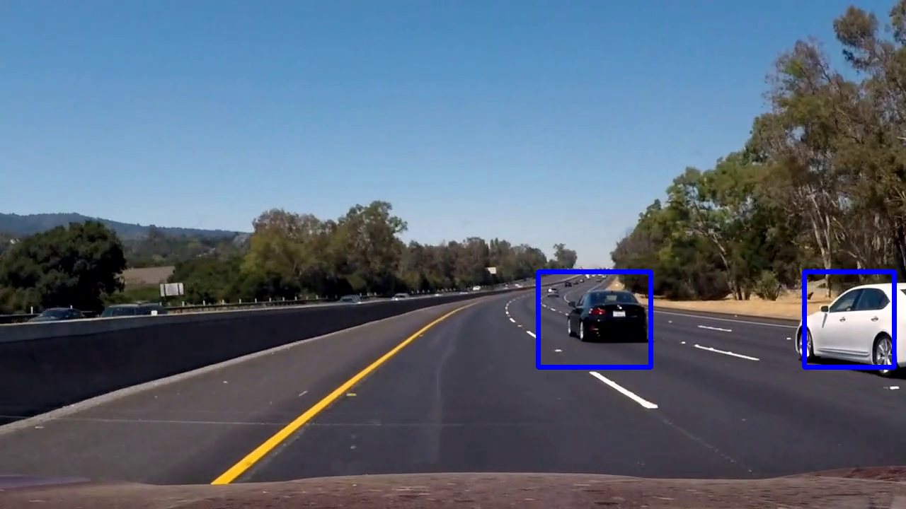

## Writeup

---

**Vehicle Detection Project**

The goals / steps of this project are the following:

* Perform a Histogram of Oriented Gradients (HOG) feature extraction on a labeled training set of images and train a classifier Linear SVM classifier
* Optionally, you can also apply a color transform and append binned color features, as well as histograms of color, to your HOG feature vector. 
* Note: for those first two steps don't forget to normalize your features and randomize a selection for training and testing.
* Implement a sliding-window technique and use your trained classifier to search for vehicles in images.
* Run your pipeline on a video stream (start with the test_video.mp4 and later implement on full project_video.mp4) and create a heat map of recurring detections frame by frame to reject outliers and follow detected vehicles.
* Estimate a bounding box for vehicles detected.

## [Rubric](https://review.udacity.com/#!/rubrics/513/view) Points
### Here I will consider the rubric points individually and describe how I addressed each point in my implementation.  

---
### Histogram of Oriented Gradients (HOG)

#### 1. HOG features

To extract the HOG features, I used the functions presented in the lesson which can be found in `lesson_functions.py`.

I started by reading in all the `vehicle` and `non-vehicle` images. I used the images from the dataset given in the lesson. Here is an example of one of each of the `vehicle` and `non-vehicle` classes:

I experimented with color spaces and different `skimage.hog()` parameters (`orientations`, `pixels_per_cell`, and `cells_per_block`).

Here is an example using the `YCrCb` color space and HOG parameters of `orientations=8`, `pixels_per_cell=(8, 8)` and `cells_per_block=(2, 2)`:

Example source image

Examples of results of HOG for channels Y, Cr, and Cb respectively:

#### 2. Final choice of HOG parameters

I tried various combinations of parameters and made sure the Support Vector Machine classifier was able to get a good score, with the chosen parameter values the accuracy was rounded to 1.0.

#### 3. Classifier training

I trained a linear SVM using HOG features and color features. I applied both the remaining techniques described in the lessons (spatial binning and color histograms).
 I concatenated all the features and used a scaler to help the classifier learn.

### Sliding Window Search

#### 1. Sliding window search

I used a 64x64 pixel default window size.
I then manually checked a suitable range in the y direction in the image to check for cars.
The y range varies slightly between different scales but is in the range `360-390` for the start and `490-640` for the stop.
I used six different scales to scan the image (as described in `find_cars.py (line 100-107)`).

Below is an example of a sliding window search with window scale 1 (so per step 64x64 pixels)
and 8 cells per step of 8 pixels (meaning no overlap).

Below is an example of the same settings, except the scale is now 2.

#### 2. Examples of test images

Below are examples of images before and after detection. Some false positives are still detected (example 4). Overall the cars
 are detected well.

Before 1:

After 1:

Before 2:

After 2:

Before 3:

After 3:

Before 4:

After 4:

Before 5:

After 5:

Before 6:

After 6:

---

### Video Implementation

#### 1. Final output
Here's a [link to my video result](./result_vid.mp4)

#### 2. Filter false positives

I recorded the positions of positive detections in each frame of the video.
 From the positive detections I created a heatmap and then thresholded that map in an attempt to reduce false positives.
 I used scipy.ndimage.measurements.label() (`predict_vehicle.py` line 84)to generate labels for each 'blob'.
 I then calculated the min and max values for the x and y coordinates for each label and drew a bounding box accordingly
 (`predict_vehicle.py` lines 20-40).

The code for this can be found in `predict_vehicle.py` (lines 15-92).

---

### Discussion
Some False positives are still detected, this could be fixed by doing more negative-negative mining.
Furthermore, the bounding boxes are sometimes a bit large, this is very likely due to the data that is selected.
When a portion of the car is visible in a patch, the patch is classified under vehicle for training.
Because of this, the parts around the car are also detected as vehicle, and thus classified as such.

To prevent the black and white car being detected as one vehicle, the number of vehicles on screen could be tracked,
making sure that two vehicles never blend into one. A more complex detection would have to be used to separate one blob in the
heat map into multiple labels.
